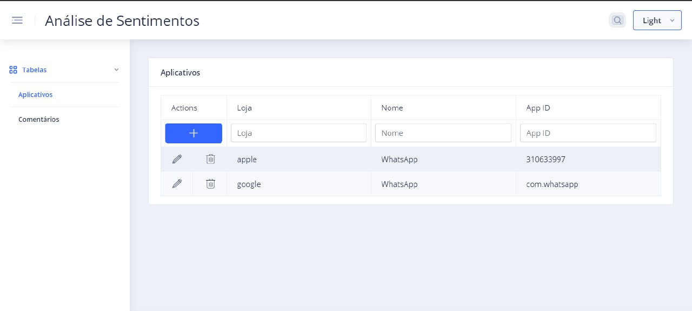
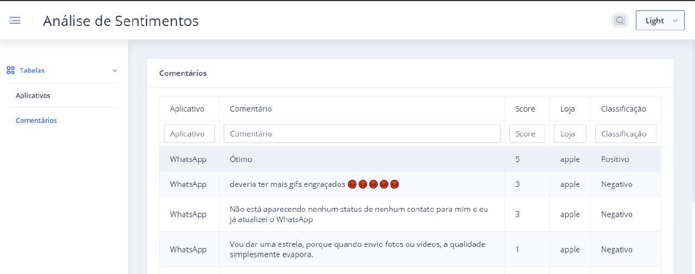
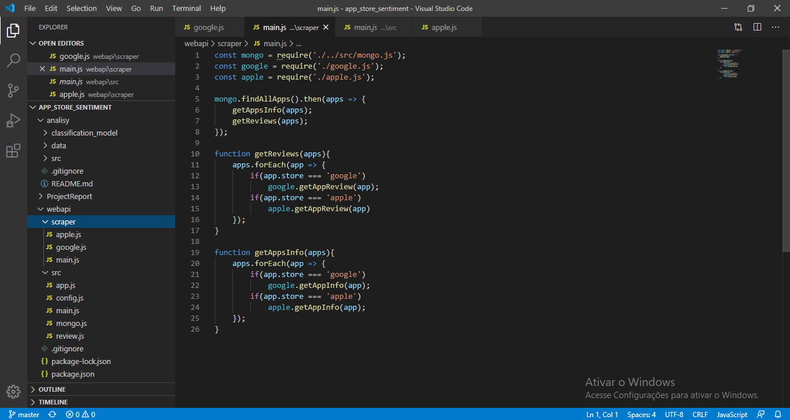

# Data Science Project Report: Extração de Dados dos aplicativos das lojas iTunes/Mac App Store e Google Play store. Obter a melhor acurácia sobre os dados com a combinação de algoritmos de Machine Learning. Para avaliação dos apps quanto a satisfação dos usuários.

Esse arquivo contem informações sobre o projeto que está sendo executado (neste caso, Obtenção de dados das lojas iTunes/Mac App Store e  Google Play store, e avaliação através dos comentários usando um comitê de algoritmos de machine learning)

## 1. Entendendo o Negócio
*NOTA: Este é um exemplo de tutorial, portanto, o escopo, o plano etc. não correspondem necessariamente a um projeto real de ciência de dados que aborda uma questão comercial específica. Em um projeto real, é provável que a seção de definição do problema, escopo, plano e pessoal seja muito mais detalhada, com base em discussões com o cliente (ou proprietário da empresa), a estrutura da e-quipe de ciência de dados etc. 

### Definição do Problema
O objetivo deste projeto é mostrar uma avaliação dos apps obtidos das lojas da Apple Store e Google Store usando para isso ferramentas de extração. A classificação é feita com base nos comentários dos usuários. Através de algoritimos de machine Learning é possível extrair qualificação dos comentários. É classificado cada comentário em positivo e negativo. Após classificados será realizada uma interação com os usuários.

Mais informações sobre os Algoritimos de Extração poderá ser encontrado aqui:
[app-store-scraper](https://www.npmjs.com/package/app-store-scraper#reviews) 
[google-play-scraper](https://www.npmjs.com/package/google-play-scraper#reviews) 

### Escopo:

 * O escopo desta amostra é extrair informações dos apps da Google Store e Apple Store e armazenar num banco de dados;
 * O cadastro inicial é determinado pelo usuário que informará qual app deseja cadastrar.
 * Um Schedules fica atualizando e baixando todos os demais campos dos apps cadastrados;
 * O commitê algoritmo escolhido por obtenção de melhores resultados é usado para classificar os comentários onde incluirá um registro de estado positivo ou negativo para cada comentário.
 * Uma aplicação web e um servidor API para interagir com os usuários em conjunto com um framework de visualização de gráficos e dashboards interativos;

## Plano
Nós seguimos na ordem de cada estagio do processo. A ordem e a documentação do projeto segue abaixo. Também foram incluídas as ferramentas usadas para desenvolver esse projeto.

### Equipe Pessoal
O Projeto é desenvolvido por 2 **analistas de sistemas** que desenvolveram a API, o consumo da mesma por uma aplicação Web e  toda a persistência dos Dados. Um **cientistas de Dados** fez a parte de extração e classificação dos dados com ferramentas python de Machine Learning. Um **analista de negócios** foi responsável por criar as perguntas necessárias para montagem dos Dash Boards e elaboração das regras de negócios.

### Métricas
Para classificação dos Dados e obtenção do melhor modelo treinado foram usados os algoritmos supervisionados NB, Regressao Logistica, SGB, e o Commite, obtendo uma acurácia 0.85, 0.88, 0.87, e 0.88 respectivamente. Chegando-se a conclusão que o commite de algoritmos foi melhor que o resultado individual de cada.

## 2. Aquisição e entendimento de Dados

Inicialmente os Dados são baixados e cadastrados numa base. Usando como base o Aplicativo Whatsapp com seus dados extraídos juntamente com seus comentários das lojas Google e Apple. 
Esse dados foram extraídos das lojas [google](https://play.google.com/store/apps?hl=pt_BR)  e [apple](https://apps.apple.com/)  
E para o aplicativo Whastapp https://play.google.com/store/apps/details?id=com.whatsapp&hl=pt_BR  e https://apps.apple.com/br/app/whatsapp-messenger/id310633997 

### Exploração dos Dados com algoritmos de Machine Learning Supervisonados
Após obtidos os dados armazenados no Banco são usados os algoritmos de Aprendizagem de máquina NB, Regressão Logística, SGB e a combinação dos 3 que através de um data set são gerados os modelos treinados e obtenção de resultados com maior número de resultados positivos e negativos. Avaliando e classificando cada comentário do  Whastapp como positivo e negativo das lojas google e apple.

## 3. Modelando

### Servidor Node
Foi desenvolvido um servidor com o framework Node.js que receberá as requisições de cadastro de app, listagem e exclusão do mesmo. E Listagem dos comentários. O servidor usa as bibliotecas google-play-scrapper e app-store-scrapper do repositório npm para obter os dados do app informado pelo usuário e armazerá essas informações no banco MongoDb. 

### Cron Shcedules 
Um cron Schedules ficará salvando as demais informações do app a cada período ou através de uma ação do usuário para atualização;

Outro CronScheduler roda o algoritmo python para classificar os apps cadastro no Banco. Após claissificado é incluído um campo para classificação informando os valores positivo ou negativo

### Aplicação Web
Uma aplicação web desenvolvido com o Framework Angular na linguagem typescript será responsável por fazer requisições ao servidor. Onde através dessa será possível cadastrar, lista e remover apps. Também será possível navegar nos apps e listar os seus comentários. 

### Cliente web com Echarts 
Usando a ferramenta [echarts](https://echarts.apache.org/en/index.html) que foi todo desenvolvido em JavaScript é possível montar dashboards e integrar dentro do projeto web. Com isso usuários poderão montar seus próprios dashboards com base nos apps cadastrados. Além disso a classificação dos apps possibilita montagem de dashboards em cima da avaliação dos usuários dos apps.

### Modelos Treinados
Nós usamos 3 algorítimos python de machine learning de modelo supervisionado para uma melhor obtenção de resultados.

### Avaliação do Modelo
A precisão de cada modelo foi medida e comparada individualmente e em conjunto de acordo com commitê.

#### Algoritmo de Regressão Logística

```python
Running Logistic Regression ...

Result Logistic Regression
Accuracy: 0.881116
[[2134  287]
 [ 301 2224]]
              precision    recall  f1-score   support

         neg       0.88      0.88      0.88      2421
         pos       0.89      0.88      0.88      2525

    accuracy                           0.88      4946
   macro avg       0.88      0.88      0.88      4946
weighted avg       0.88      0.88      0.88      4946

Saving model Logistic_Regression
Model saved (Logistic_Regression_model.sav) in folder classification_model/
```

Como foi observado a regressão logística obteve uma precisão de 0.88 para resultados positivos e 0.89 para resultados negativos. E uma acurácia de 0.88

#### Algoritmo Multinomial NB

```python
Running Multinomial NB ...

Result Multinomial NB
Accuracy: 0.844521
[[2101  320]
 [ 449 2076]]
              precision    recall  f1-score   support

         neg       0.82      0.87      0.85      2421
         pos       0.87      0.82      0.84      2525

    accuracy                           0.84      4946
   macro avg       0.85      0.85      0.84      4946
weighted avg       0.85      0.84      0.84      4946

Saving model Multinomial_NB
Model saved (Multinomial_NB_model.sav) in folder classification_model/
```

Como foi observado o NB obteve uma precisão de 0.82 para resultados positivos e 0.87 para resultados negativos. E uma acurácia de 0.84

#### Algoritmo  SGD

```python
Running SGD ...

Result SGD
Accuracy: 0.878488
[[2123  298]
 [ 303 2222]]
              precision    recall  f1-score   support

         neg       0.88      0.88      0.88      2421
         pos       0.88      0.88      0.88      2525

    accuracy                           0.88      4946
   macro avg       0.88      0.88      0.88      4946
weighted avg       0.88      0.88      0.88      4946

Saving model SGD
Model saved (SGD_model.sav) in folder classification_model/
```

Como foi observado o SGD obteve uma precisão de 0.88 para resultados positivos e 0.88 para resultados negativos. E uma acurácia de 0.88

#### Committe

```python
Running Committee ...

Result Committee
Accuracy: 0.884351
[[2139  282]
 [ 290 2235]]
              precision    recall  f1-score   support

         neg       0.88      0.88      0.88      2421
         pos       0.89      0.89      0.89      2525

    accuracy                           0.88      4946
   macro avg       0.88      0.88      0.88      4946
weighted avg       0.88      0.88      0.88      4946
```

Como foi observado o Committe obteve uma precisão de 0.89 para resultados positivos e 0.89 para resultados negativos. E uma acurácia de 0.88.
Chegando a conclusão que a combinação dos 3 algoritmos obteve um melhor resultado em relação aos 3 individualmente.

## 4. Desenvolvimento

Com o desenvolvimento de uma Api node.js foi possível controlar as requisições provindas de um cliente. Onde ocorre onde ocorrem as requisições do tipo cadastro de um novo App, listagem remoção do mesmo. E listagem das Reviews dos usuários por app.

Os dados são salvos numa Base [MongoDb](https://www.mongodb.com/)  no formato json.

O intuito da API é manter o cadastro dos apps no banco de dados. Um processo agendado irá executar, recuperar os apps cadastrados e extrair todos atributos através da biblioteca google scraper e Apple Scraper. O processo agendado poderá rodar num período definido.

### Tela de Cadastro, listagem e exclusão dos Apps



### Tela de Listagem dos Comentários




Para o frontend foi usado o framework Angular;

## Controle de Versão e Repositório

Para controle de versão foi usado a ferramenta Git e para hospedagem de o projeto foi usada a plataforma Github. Onde para cada participante do projeto foi criada uma Branch. 
Ao término de um MVP foram realizados os merges de todas as Branchs com a Master, acompanhado do relatório do projeto.

### Código de Execução

Na imagem abaixo segue um exemplo do código projeto utilizando a IDE Visual Studio Code.
Executando a linguagem javasctript do servidor node.js;



## Referências
[Project Repository in GitHub](https://github.com/MarcosMendes9389/app_store_sentiment)

