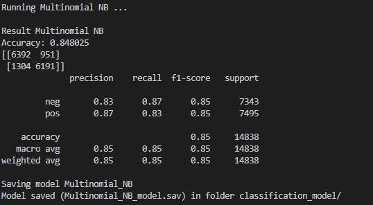

# Data Science Project Report: Extração de Dados dos aplicativos das lojas iTunes/Mac App Store e  Google Play store. Obter a melhor acurácia sobre os dados com a combinação de algoritmos de Machine Learning. Para avaliação dos apps quanto a satisfação dos usuários.

Esse arquivo contem informações sobre o projeto que está sendo executado (neste caso, Obtenção de dados das lojas iTunes/Mac App Store e  Google Play store, e avaliação através dos comentários usando um comitê de algoritmos de machine learning)

## 1. Entendendo o Negócio
*NOTA: Este é um exemplo de tutorial, portanto, o escopo, o plano etc. não correspondem necessariamente a um projeto real de ciência de dados que aborda uma questão comercial específica. Em um projeto real, é provável que a seção de definição do problema, escopo, plano e pessoal seja muito mais detalhada, com base em discussões com o cliente (ou proprietário da empresa), a estrutura da e-quipe de ciência de dados etc. 

### Definição do Problema
O objetivo deste projeto é mostrar uma avaliação dos apps obtidos das lojas da Apple Store e Google Store usando para isso ferramentas de extração. A classificação é feita com base nos comentários dos usuários. Através de algoritimos de machine Learning é possível extrair qualificação dos comentários. É classificado cada comentário em positivo e negativo. Após classificados será realizada uma interação com os usuários.

Mais informações sobre os Algoritimos de Extração poderá ser encontrado aqui:
[app-store-scraper](https://www.npmjs.com/package/app-store-scraper#reviews 
[google-play-scraper](https://www.npmjs.com/package/google-play-scraper#reviews 

### Escopo:

 * O escopo desta amostra é extrair informações dos apps da Google Store e Apple Store e armazenar num banco de dados;
 * O cadastro inicial é determinado pelo usuário que informará qual app deseja cadastrar.
 * Um Schedules fica atualizando e baixando todos os demais campos dos apps cadastrados;
 * O commitê algoritmo escolhido por obtenção de melhores resultados é usado para classificar os comentários onde incluirá um registro de estado positivo ou negativo para cada comentário.
 * Uma aplicação web e um servidor API para interagir com os usuários em conjunto com um framework de visualização de gráficos e dashboards interativos;

## Plano
Nós seguimos na ordem de cada estagio do processo. A ordem e a documentação do projeto segue abaixo. Também foram incluídas as ferramentas usadas para desenvolver esse projeto.

### Equipe Pessoal
O Projeto é desenvolvido por 2 **analistas de sistemas** que desenvolveram a API, o consumo da mesma por uma aplicação Web e  toda a persistência dos Dados. Um **cientistas de Dados** fez a parte de extração e classificação dos dados com ferramentas python de Machine Learning. Um **analista de negócios** foi responsável por criar as perguntas necessárias para montagem dos Dash Boards e elaboração das regras de negócios.

### Métricas
Para classificação dos Dados e obtenção do melhor modelo treinado foram usados os algoritmos supervisionados NB, Regressao Logistica, SGB, e o Commite, obtendo uma acurácia 0.85, 0.88, 0.87, e 0.88 respectivamente. Chegando-se a conclusão que o commite de algoritmos foi melhor que o resultado individual de cada.

## 2. Aquisição e entendimento de Dados

Inicialmente os Dados são baixados e cadastrados numa base. Usando como base o Aplicativo Whatsapp com seus dados extraídos juntamente com seus comentários das lojas Google e Apple. 
Esse dados foram extraídos das lojas [google] https://play.google.com/store/apps?hl=pt_BR  e [apple] https://apps.apple.com/  
E para o aplicativo Whastapp https://play.google.com/store/apps/details?id=com.whatsapp&hl=pt_BR  e https://apps.apple.com/br/app/whatsapp-messenger/id310633997 

### Exploração dos Dados com algoritmos de Machine Learning Supervisonados
Após obtidos os dados armazenados no Banco são usados os algoritmos de Aprendizagem de máquina NB, Regressão Logística, SGB e a combinação dos 3 que através de um data set são gerados os modelos treinados e obtenção de resultados com maior número de resultados positivos e negativos. Avaliando e classificando cada comentário do  Whastapp como positivo e negativo das lojas google e apple.

## 3. Modelando

### Servidor Node
Foi desenvolvido um servidor com o framework Node.js que receberá as requisições de cadastro de app, listagem e exclusão do mesmo. E Listagem dos comentários. O servidor usa as bibliotecas google-play-scrapper e app-store-scrapper do repositório npm para obter os dados do app informado pelo usuário e armazerá essas informações no banco MongoDb. 

### Cron Shcedules 
Um cron Schedules ficará salvando as demais informações do app a cada período ou através de uma ação do usuário para atualização;

Outro CronScheduler roda o algoritmo python para classificar os apps cadastro no Banco. Após cadastrado é incluído um campo para classificação informando os valores positivo ou negativo

### Aplicação Web
Uma aplicação web desenvolvido com o Framework Angular na linguagem typescript será responsável por fazer requisições ao servidor. Onde através dessa será possível cadastrar, lista e remover apps. Também será possível navegar nos apps e listas os seus comentários. 

### Cliente web com Echarts 
Usando a ferramenta [echarts] https://echarts.apache.org/en/index.html que foi todo desenvolvido em JavaScript é possível montar dashboards com e integrar dentro do projeto web. Com isso usuários poderçao montar seus prórprios dashboards com base nos apps cadastrados. Além disso a classificação dos apps possibilita montagem de dash boars em cima da avaliação dos usuários dos apps.

